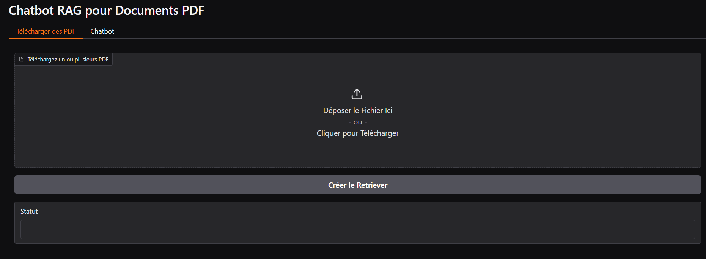
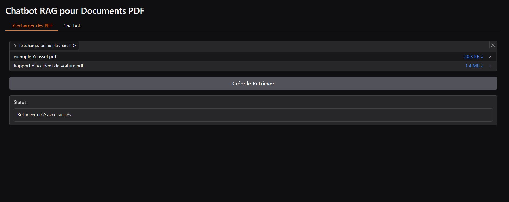
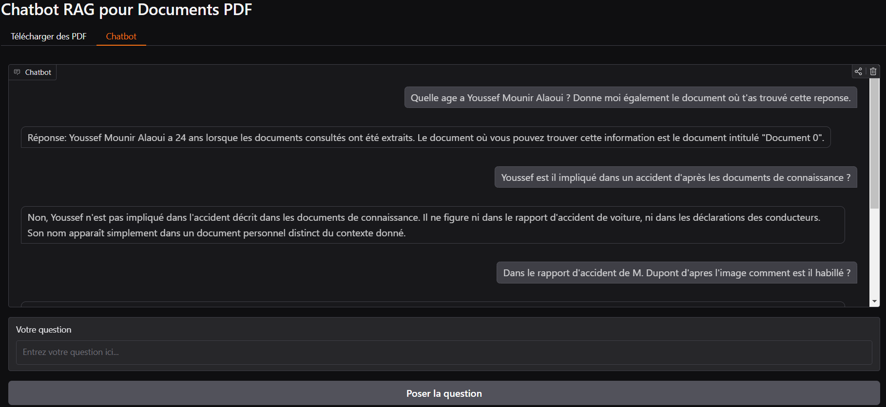

# Multimodal RAG Chatbot for Multi-Structured Documents

## Overview
This project implements a **Retrieval-Augmented Generation (RAG) chatbot** capable of answering questions based on the content of uploaded PDF documents. It utilizes **Chroma** for vector storage, **Hugging Face transformers** for language models, and **multi-vector retrieval** to enhance response accuracy. The chatbot supports both **text and multimodal inputs** (text and images), integrating **summarization, document retrieval, and text generation** to provide detailed answers.

## Usage Guide
1. **Access the chatbot:** [Visit my Hugging Face Space](https://huggingface.co/spaces/yoy2000/RAG_vision_documents) *(Note: It might be paused at times).*
   
3. **Upload PDFs:** On the first page, upload multiple PDF documents to initialize the retriever.
   
5. **Ask questions:** Move to the second page and ask questions based on the uploaded documents.
   

## Key Features
### Document Processing
- **PDF Extraction:** Uses `pdfplumber` to extract text, tables, and images.
- **Text Summarization:** Summarization is powered by a **BART-based transformer model**.
- **Image Description:** Images are processed with the **Llava multimodal transformer model**, which generates detailed captions.

### Multi-Vector Retrieval
- **Chroma-based vector store**: Stores document embeddings for fast retrieval.
- **MultiVectorRetriever**: Each document is summarized and stored as hierarchical chunks, enhancing retrieval efficiency and accuracy.

### Language Model
- Utilizes **Zephyr 7B (quantized)** from Hugging Face for text generation.

## Technologies Used
- **Gradio** - Web interface development.
- **Langchain** - Document processing & multi-vector retrieval.
- **Chroma** - Vector store for document embeddings.
- **Hugging Face Transformers** - Used for embeddings, summarization, and text generation.
- **Torch** - GPU acceleration & model quantization.
- **pdfplumber** - PDF content extraction.
- **Pandas** - Table data cleaning & management.

## Limitations
- **Retriever Initialization Time:** Generating embeddings and descriptions takes time.
- **Response Speed:** Due to the large LLM used, responses may have some latency.
- **Image-Based Queries:** Answers are limited by the generated image descriptions, making complex image-based reasoning challenging.

## Contact
For further inquiries, feel free to reach out at **mouniralaouiyoussef@hotmail.fr**.

